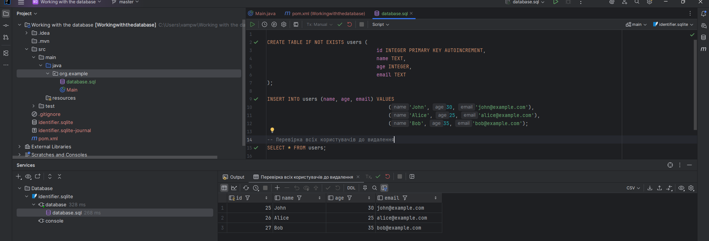
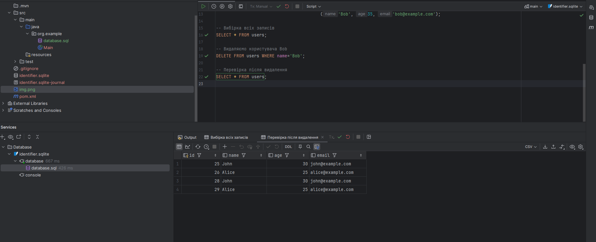

# Database Homework 27.1

This project is a solution for Homework 27.1: Working with a Database.

## Task Description

- Create a database named `my_database`.
- Create a table `users` with the following fields:
  - `id` (integer, auto-increment, primary key)
  - `name` (string)
  - `age` (integer)
  - `email` (string)
- Insert the following data into the `users` table:
  - John, 30, john@example.com
  - Alice, 25, alice@example.com
  - Bob, 35, bob@example.com
- Select all records from the `users` table and display them.
- Delete the user with the name "Bob" from the `users` table.
- Verify that the data was inserted and displayed correctly.
- Verify that the user "Bob" was successfully deleted.

## SQL Queries

All SQL queries are saved in the file `sql/queries.sql`.

## Results

### 1. Data Selection

Below is a screenshot of the result after selecting all records from the `users` table:

### 2. Data Deletion

Below is a screenshot of the result after deleting the user "Bob":

## How to Run

1. Import the SQL file into your database.
2. Execute the queries step by step.
3. Check the results as shown in the screenshots.

---

Replace `path/to/your/first_screenshot.png` and `path/to/your/second_screenshot.png` with the actual paths to your screenshots in the repository.
